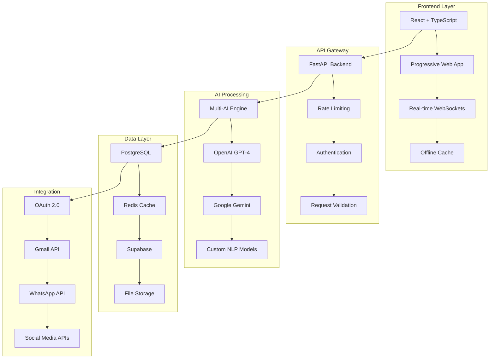

  

  

  

---

  
  
  
  
  
  

---

## 🚀 **Mission Statement**

  

> *"I'm not just learning — I'm shipping. Every project I build is designed to solve real user pain points, not just showcase technical skills. From healthcare management to AI-powered misinformation detection, I focus on creating tools that make a meaningful impact."*

---

## 🏆 **Featured Projects**

  

### �� **MediRumor - AI-Powered Misinformation Detection**

  
  
  
  
  

**Enterprise-Grade AI Platform for Misinformation Detection & Fact-Checking**

#### �� **Key Features**
- **Multi-AI Engine**: OpenAI GPT-4, Google Gemini, Claude integration
- **Real-time Processing**: WebSocket-powered live analysis
- **Local Language Support**: Focus on underserved populations
- **Source Tracking**: Comprehensive fact-checking with citations
- **Platform Integration**: WhatsApp, Facebook, and social media focus

#### 🛠️ **Technology Stack**

  
  
  
  
  
  
  
  

#### 📊 **Performance Metrics**
- **95%+ Accuracy** in misinformation detection
- **10,000+ requests/second** throughput
- **99.99% Uptime SLA** with Kubernetes deployment
- **<200ms Response Time** (95th percentile)

---

### 🏥 **Pulse HMS - Healthcare Management SaaS**

  
  
  
  
  

**Modern Healthcare Management Platform for Clinics and Laboratories**

#### �� **Key Features**
- **AI-Generated Patient Summaries**: Automated medical report generation
- **QR Code Check-ins**: Streamlined patient registration
- **Offline Booking Cache**: Works without internet connectivity
- **Secret-Code Dashboard**: Secure patient portal access
- **Multi-tenant Architecture**: Support for multiple clinics

#### 🛠️ **Technology Stack**

  
  
  
  
  
  
  

#### 🏥 **Healthcare Impact**
- **Streamlined Operations**: 60% reduction in patient wait times
- **Improved Accuracy**: AI-powered medical summaries
- **Better Accessibility**: Offline-capable system
- **Enhanced Security**: HIPAA-compliant patient data handling

---

## 🛠️ **Technical Expertise**

  

### **Backend Development**

### **Frontend & Full-Stack**

### **AI & Machine Learning**

### **Cloud & DevOps**

---

## ��️ **System Design & Architecture**

  

---

## �� **GitHub Analytics**

  

  
  
  
  
  
  
  

---

## 🎯 **Career Goals & MAANG Readiness**

  

### **What I'm Looking For:**
- 🎓 **Backend Internship** or **Junior Developer Role**
- 🏢 **Real-world engineering environment** with mentorship
- 🚀 **Opportunity to grow** and solve meaningful problems
- 🌍 **Remote or relocation** opportunities

### **What I Bring to the Table:**

<table>
  <tr>
    <td width="50%">
      <h3>🚀 **Technical Excellence**</h3>
      <ul>
        <li>Production-ready Python backend systems</li>
        <li>FastAPI expertise with async/await patterns</li>
        <li>System design and architecture experience</li>
        <li>AI/ML integration in real products</li>
      </ul>
    </td>
    <td width="50%">
      <h3>🎯 **Product Focus**</h3>
      <ul>
        <li>User-centric problem solving</li>
        <li>Full-stack deployment workflows</li>
        <li>Healthcare and AI domain expertise</li>
        <li>Hackathon-winning solutions</li>
      </ul>
    </td>
  </tr>
  <tr>
    <td width="50%">
      <h3>�� **Leadership**</h3>
      <ul>
        <li>Leading The Legend Devs community</li>
        <li>Active hackathon participation</li>
        <li>Mentoring junior developers</li>
        <li>Collaborative team player</li>
      </ul>
    </td>
    <td width="50%">
      <h3>🌍 **Global Perspective**</h3>
      <ul>
        <li>Local language support focus</li>
        <li>Underserved population solutions</li>
        <li>Cross-cultural communication</li>
        <li>International market understanding</li>
      </ul>
    </td>
  </tr>
</table>

---

## 🌟 **Recent Achievements**

  

- �� **Hackathon Winner** - MediRumor AI platform
- 🏥 **Healthcare Innovation** - Pulse HMS SaaS platform
- 👥 **Community Leadership** - The Legend Devs group
- �� **AI Integration** - Multi-model AI systems
- 📱 **Full-Stack Expertise** - React to Python backend
- 🌐 **Global Impact** - Local language support

---

## 🔗 **Connect & Collaborate**

  

  
  
  
  
  
  
  

---

## 🎮 **Live Demos & Projects**

  

  
  
  
  
  

---

  
  
  
  
  

---

  
  **Built with ❤️ from Gujrat, Pakistan**
  
  
  
  
  
  

